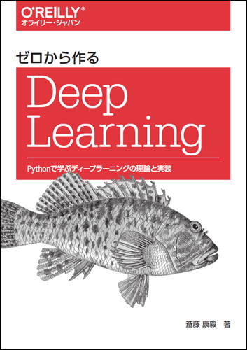

# Deep Learning from scratch - Saito 

  

This repository contains python code in ipynb format - implemented using Numpy and raw data for practice of  "Deep Learning from scratch - Saito".

* Contents
	- Activation function
		1. step function
		2. sigmoid function
		3. ReLU function
		4. identity function
		5. softmax function
	- Loss_function
		1. MSE (mean squared error)
		2. RMSE (root mean squared error)
		3. RMSLE (root mean sqared logarithmic error)
		4. CEE (cross entropy error)
	- Gradient
		1. differentiation
		2. gradient calculation
	- Forward & Backward propagation
		1. simple layer
		2. ReLU layer
		3. sigmoid layer
		4. affine/softmax layer
	- Optimizer
		1. stochastic gradient descending
		2. momentum
		3. adagrad
		4. adam
	- Multi-layer perceptron
		1. multi-layer perceptron
		2. weight decay
		2. dropout
	- Weight
		1. Xabier initialization
		2. He initialization
		3. weight normalization
	- Convolution Neural Networks

 